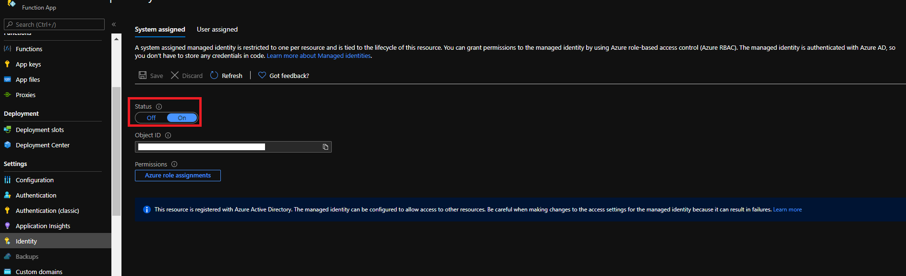

# An Azure Digital Twins application with Azure Percept DK

## Overview

This repository documentation for the Azure Digital Twins application with preloaded Azure Percept DK module.
In this repository, you will find:

* How Azure Percept DK interacts with Azure Digital Twins
  * After completing Azure Percept DK OOBE, add an Azure Percept DK digital twin
  
  * Handle the inference from Azure Percept DK, and update to Azure Percept DK digital twin
  
* [dt_function](dt_function): The code for an Azure function app, which is response for receiving event from IoT Hub and update information to Azure Digital Twins
* [models](models): Some digital models definition example

## Azure Percept DK

Azure Percept DK is an ASUS x Microsoft Azure Perception edge AI development kit designed for developing vision and audio AI applications with [Azure Percept Studio](https://docs.microsoft.com/en-us/azure/azure-percept/overview-azure-percept-studio). Azure Percept DK integrated hardware accelerator with Azure AI and Azure IoT services and designed them to be simple to use and ready to go with minimal setup:
  * Out-Of-Box experience(OOBE) brings your Azure Percept DK to Azure Portal in minutes
  * AI model lifecycle management software enables you to build and deploy complete computer vision applications, from simple no-code models to more advanced applications
  * Hardware base sensor access control, secure sensing data and the AI model

## Azure Digital Twins
Digital twins, digital replicas of their physical world, help us to really understand these intricate environments. Azure Digital Twins, a platform as a service (PaaS) offering that enables the creation of twin graphs based on digital models of entire environments. These digital models can be used to gain insights that drive better products, optimized operations, reduced costs, and breakthrough customer experiences. More information can be accessed at [Azure Digital Twins Documentation](https://docs.microsoft.com/en-us/azure/digital-twins/)

The Azure Digital Twins Explorer is a developer tool, provide by Azure, for the Azure Digital Twins service. It lets you connect to an Azure Digital Twins instance to understand, visualize and modify your digital twin data. You can try web version or download and run at local. Visit the [Explorer github](https://github.com/Azure-Samples/digital-twins-explorer) to get more information.

## Workflow

This repository can be used for connecting Azure Percept DK with Azure Digital Twins. Below picture shows the architecture, and can see there are two data flow. One is inference telemetry from Azure Percept DK, another is new Azure Percept DK makes registration via OOBE

Flows:
1. Create Azure Digital Twins service at [Azure Portal](https://portal.azure.com/), keep the service url  - `https:// + Host name`

2. Upload digital models by Azure Digital Twins Explorer (preview)
   1. Click `Open Azure Digital Twins Explorer (preview)` to open explorer web version
   
   2. Click `Upload a directory of Models` and choose [models folder](models)
   
3. Start DT-function Azure function app from [dt_function](dt_function), and set application settings with
   * DT_URL: The Azure Digital Twins service url from step 1
   * DT_PERCEPT_MODEL_ID: The model id used for create digital twin after getting the IoT Hub Created event. You can set value with `dtmi:asus:smart_building:Elevator_DK;1` or `dtmi:asus:smart_building:Entry_DK;1`
4. Create IoT Hub and add two IoT Hub event subscription
   1. For inference telemetry, Choose Device Telemetry event type and bind endpoint with TelemetryEvent of DT-fcuntion
   
   2. For Azure Percept DK OOBE, Choose Device Created event type and bind endpoint with CreateEvent of DT-fcuntion
   
5. To let DT-function interact with Azure Digital Twins, this repository use [Azure AD-managed identities](https://docs.microsoft.com/en-us/azure/active-directory/managed-identities-azure-resources/) to pass the Azure Digital Twins certification.
    1. Turn Identity -> system assigned -> status to ON at DT-function
    
    1. At Azure Digital Twins `Access Control(IAM)`, assign role `Azure Digital Twins Data Owner` to DT-function
    

## Next steps
There are some suggestion for next steps:
 1. Azure Digital Twins Explorer is just a development tool, access [Azure Digital Twins APIs and SDKs](https://docs.microsoft.com/en-us/azure/digital-twins/concepts-apis-sdks) to understand API and SDK to build custom Azure Digital Twins client application
 2. Like IoT Hub, there are some Azure Digital Twins events that can be routed to other Azure resources to do more complex functions. Access [Route events within and outside of Azure Digital Twins](https://docs.microsoft.com/en-us/azure/digital-twins/concepts-route-events) for details